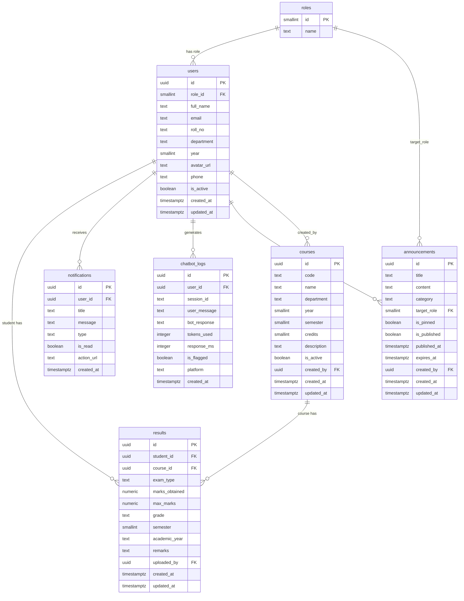

# ER Diagram — ABC Polytechnic Digital Platform

---

## Relationships Summary

| Relationship | Type | Description |
|---|---|---|
| roles → users | 1:N | One role assigned to many users |
| users → results | 1:N | A student has many result records |
| courses → results | 1:N | A course has results for many students |
| users → notifications | 1:N | A student receives many notifications |
| users → chatbot_logs | 1:N | A user generates many chatbot conversations |
| users → announcements | 1:N | An admin creates many announcements |
| roles → announcements | 1:N | Announcements can be targeted to a role |

---

## Key Constraints

- `results` has UNIQUE constraint on `(student_id, course_id, exam_type, semester, academic_year)`
- `users.roll_no` is UNIQUE (students only, nullable for admins)
- `users.email` is UNIQUE
- `courses.code` is UNIQUE
- Grade is **auto-computed** via PostgreSQL trigger based on percentage
